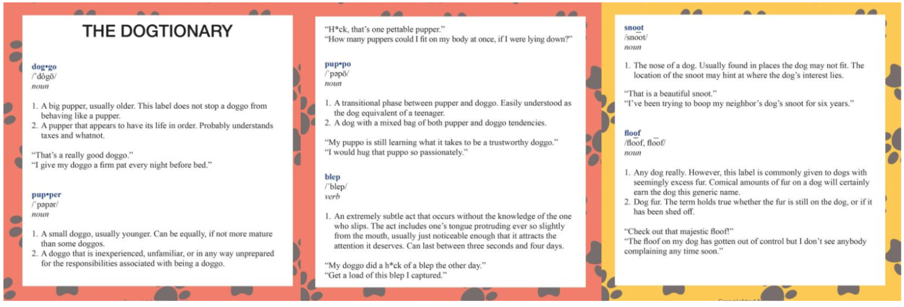

The aim of this project was to programmatically gather and correct Twitter data, as well as analyze trends in the popular WeRateDogs Twitter account, which typically rates submitted pictures of dogs (or objects posting as dogs) on a scale of 0/10 to 15/10.

The primary data points considered were the rating assigned to the dog, the apparent dog breed, the time that the tweet was posted, the number of times that the tweet was favorited or retweeted, and the "label" the post used for the dog (doggo, floofer, pupper, puppo), which denote dog stages as described in the following image:

The Python code can be found [here](https://github.com/eskrav/udacity-data-analyst/blob/master/data-wrangling/wrangle_act.ipynb), while a brief writeup of the process can be found [here](https://eskrav.github.io/udacity-data-analyst/data-wrangling/wrangle_report.html).

A writeup presenting a few of the more interesting data trends can be found [here](https://eskrav.github.io/udacity-data-analyst/data-wrangling/act_report.html).
